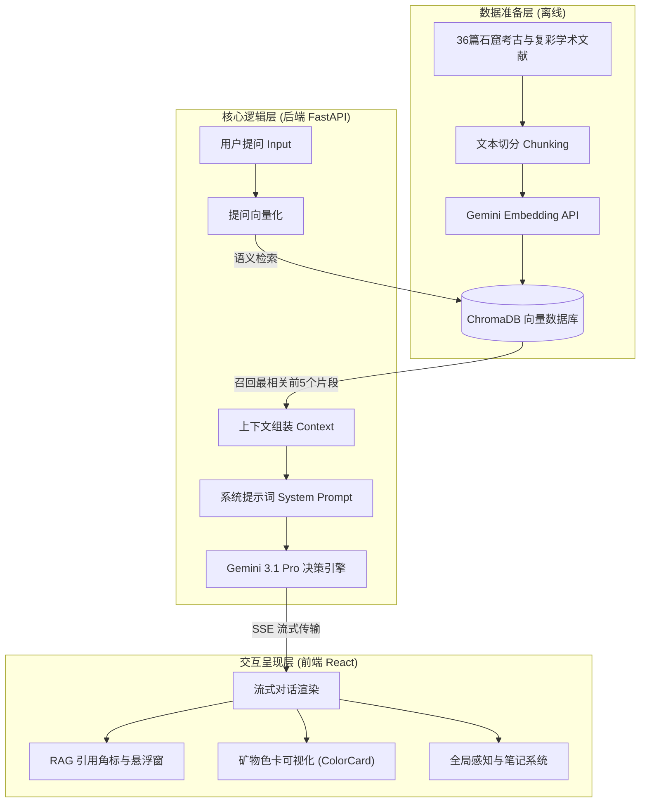

# 附件 1：智能体“问窟者”系统架构与逻辑流程说明

本项目核心交互系统——“问窟者”智能体，是一个基于大语言模型（LLM）与检索增强生成（RAG，Retrieval-Augmented Generation）技术构建的栖霞山石窟造像数字复彩领域专家系统。本系统旨在解决传统大模型在文化遗产领域存在的“幻觉”问题，确保所有交互与学术回答均有据可查。

---

## 一、 系统总体架构

系统的架构分为三层：**数据准备层（离线）**、**核心逻辑层（后端）** 与 **交互呈现层（前端）**。

---

## 二、 核心逻辑与运行流程

当用户在界面中输入关于“栖霞山石窟造像复彩”的提问时，系统会触发以下完整执行流：

### 1. 语义向量检索 (Retrieval)
*   **提问转换**：系统调用 `gemini-embedding-001` 接口，将用户的自然语言提问转换为一串 768 维的数学向量。
*   **向量库比对**：将提问向量传入本地 `ChromaDB` 向量数据库，使用**余弦相似度（Cosine Similarity）**算法，在已经分块建立索引的 36 篇（共 2782 个分块）核心学术文献中，检索出关联度最高的 **5 个文献片段**。

### 2. 上下文与提示词拼装 (Augment)
*   **注入背景知识**：后端程序将这 5 个来自权威文献的片段作为“限定背景知识”注入到大模型的提示词中。
*   **注入角色约束**：结合预先设计好的“问窟者”系统指令（System Instructions），严格限制大模型：“如果检索到的文献中没有相关内容，必须诚实回答不知道，严禁编造历史与复彩数据”。

### 3. 智能生成与流式输出 (Generation & SSE)
*   **流式响应（SSE）**：后端调用 `Gemini 3.1 Pro` 生成回答，为了提升交互的即时感，回答通过 **Server-Sent Events (SSE)** 技术逐字流式传输到前端。
*   **学术引注体系（Citation）**：系统在生成回答的同时，会自动在涉及文献的语句末尾打上引用角标（如 `[1]`）。

---

## 三、 智能体交互设计亮点

从交互设计与视觉呈现角度，本系统实现了以下创新：

1. **学术引用跳转机制 (Academic Linkage)**
   *   用户点击 AI 回复中的引用角标，右侧的“文献库面板”会自动点亮并无缝**滚动、高亮定位**到该文献的对应原始段落。该机制基于多 fragment 关键词重合度评分算法实现。
2. **色彩指纹与矿物色卡 (ColorCard Visualizer)**
   *   当 AI 回复中提到色彩或矿物颜料（如朱砂、石青、泥金）时，前端系统会自动将其解析并转化为**可视化的色卡卡片**，让用户直观感知历史色彩的饱和度与质感。
3. **全局上下文感知球 (AgentOrb)**
   *   全站悬浮的动态光球，能够跟随用户在长卷中浏览的章节，**自动切换对话的上下文语境**（例如浏览到“舍利塔”章节时，智能体自动进入建筑与雕塑美学语境）。
