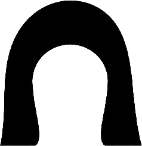

# 问窟 GrottoMind

<p align="center">
  
</p>

> 栖霞山石窟造像 AI 数字复彩交互档案馆

让沉默的石窟重新被看见、被理解、被参与。

---

## 项目简介

「问窟」是一个以栖霞山千佛岩石窟造像数字复彩为核心的交互式网站。它不是一个普通的文化介绍网站，而是一次用数字技术重新"进入"石窟的旅程。

整个网站以**单页长卷叙事**展开，用户从远望栖霞山开始，逐步走进石窟内部，了解造像的历史与风化，亲手参与数字复彩实验，与 AI 智能体对话，最终生成属于自己的"栖霞色彩记忆"。

### 核心立场

> 本项目中的"复彩"并非对历史原貌的绝对复原，而是基于文化资料、视觉研究与 AI 技术的**数字化色彩推演**。

## 叙事结构

| 章节   | 标题       | 说明                                              | 状态       |
| ------ | ---------- | ------------------------------------------------- | ---------- |
| 序章   | 远望       | 滚动驱动视频 + 水墨雾气 + 叙事文案                | ✅ 已完成  |
| 第一章 | 塔与窟     | 3D 粒子塔导航 + 8 节点深度阅读 + 学术文献引注体系 | ✅ 已完成  |
| 第二章 | 看见褪色   | 风化与残损的视觉叙事                              | 🔲 待开发  |
| 第三章 | 复彩实验室 | 对比滑杆 + 色彩方案 + 局部热点 + TD 作品          | 🔲 待开发  |
| 第四章 | 问窟 AI    | 智能体"问窟者"对话系统                            | 🔲 待开发  |
| 第五章 | 共创一龛   | 用户生成栖霞色彩记忆卡                            | 🔲 待开发  |
| 尾声   | 作品说明   | 设计理念与技术流程                                | 🔲 待开发  |

## 第一章 · 塔与窟（详细说明）

第一章以南唐栖霞山舍利塔为核心，构建了一座**博物馆级数字长卷展厅**。

### 交互架构

- **3D 粒子舍利塔**：基于 Three.js 构建的点云塔体，用户通过鼠标滚轮在 8 个标注节点间切换视角
- **GSAP 状态机**：所有镜头切换由 GSAP 时间线驱动，支持缓动锁定与过渡动画
- **深度阅读画廊**：点击节点的"深度阅读"按钮后，进入全屏横向滑动画廊

### 深度阅读节点（8 个）

| 节点   | 主题               | 核心学术内容                                     |
| ------ | ------------------ | ------------------------------------------------ |
| 综述   | 南唐遗梦           | 南唐历史背景、敷金涂彩皇家工艺                   |
| 塔刹   | 宇宙之轴           | 窣堵波源流、1930 年修葺悬疑                      |
| 密檐   | 无斗拱的智慧       | 梁思成实地考证、以石仿木力学原理                 |
| 佛龛   | 秀骨清像与盛唐遗风 | 褒衣博带与晚唐面相的跨时代美学融合               |
| 天王   | 四大天王           | 四王独立展示、法器与色彩复原推断                 |
| 菩萨   | 六牙白象与佚失大智 | 普贤幸存 / 文殊金兵毁佛 / 新样文殊图像考         |
| 须弥座 | 断代悬案           | 六朝别字误导、高越与林仁肇履历交叉推断           |
| 八相图 | 华严宗大乘孤例     | 连环画式叙事、《华严经》八相结构唯一建筑实例     |

### 学术数据来源

所有文案经由 **NotebookLM** 知识库（`流失的文物色彩：南京栖霞山石窟造像数字复彩交互设计`）查询验证，文献引注直接嵌入 UI。

### 色彩指纹系统

每张文物图片左下角附着微型**矿物颜料色卡**（Color Fingerprint），标注了基于敷金涂彩工艺推断的颜料名称与占比（如泥金 25%、朱砂 15%、石青 30%）。

## 技术栈

| 类别        | 技术                           |
| ----------- | ------------------------------ |
| 前端框架    | React 19 + TypeScript          |
| 构建工具    | Vite 8                         |
| 动画        | GSAP 3 + ScrollTrigger         |
| 平滑滚动    | Lenis                          |
| 3D / 着色器 | Three.js（开场水墨雾气 + 粒子塔） |
| 后端        | Express 5 + OpenAI API         |
| 图片导出    | html-to-image                  |

## 本地运行

```bash
# 安装依赖
npm install

# 启动开发服务器（前端 + 后端 API 同时启动）
npm run dev
```

- 前端：Vite 提供的本地地址（默认 `http://localhost:5173`）
- 后端 API：`http://localhost:8787`

## AI 配置

复制 `.env.example` 为 `.env.local`，填入：

```bash
OPENAI_API_KEY=你的密钥
OPENAI_MODEL=gpt-5.4-mini
PORT=8787
```

> **没有 API Key 也能运行**：问窟 AI 和共创卡片会使用内置的中文降级内容，所有界面和交互功能均可正常演示。

## 项目结构

```
├── src/
│   ├── App.tsx                     # 应用入口
│   ├── App.css                     # 全局样式系统
│   ├── components/
│   │   ├── IntroAnimation.tsx      # 序章 · 滚动视频叙事
│   │   ├── TimelineHall.tsx        # 第一章 · 3D粒子塔导航与节点系统
│   │   ├── DeepReadArticle.tsx     # 第一章 · 深度阅读横向画廊
│   │   ├── ParticleStupa.tsx       # 3D 粒子舍利塔渲染
│   │   ├── GrottoModelScene.tsx    # 石窟3D场景
│   │   ├── AtmosphereShader.tsx    # 水墨雾气着色器
│   │   ├── AtmosphereEffects.tsx   # 浮尘粒子系统
│   │   ├── GlowText.tsx           # 标题发光特效
│   │   ├── SandTextAnimation.tsx   # 沙化文字动画
│   │   ├── CustomCursor.tsx        # 自定义光标
│   │   ├── FullscreenButton.tsx    # 全屏切换
│   │   └── Exhibition.tsx          # 展览入口
│   ├── types.ts                    # API 类型定义
│   └── main.tsx                    # 入口文件
├── server/
│   └── index.ts                    # Express API（问窟 AI + 共创卡片）
├── public/
│   ├── assets/                     # 静态素材（视频、字体、Logo）
│   └── 章节1图片素材/              # 舍利塔各部位高清图片（WebP）
├── index.html
└── package.json
```

## 常用命令

```bash
npm run dev          # 启动开发环境（前端 + API）
npm run dev:client   # 仅启动前端
npm run dev:api      # 仅启动后端 API
npm run build        # 生产构建
npm run lint         # 代码检查
```

## 设计原则

- **博物馆级叙事感**：每一屏都像一个展厅，不是网页
- **呼吸感节奏**：大量留白、缓慢动效、沉静文案
- **轻量化实现**：优先使用预渲染视频 + CSS/GSAP 动画，避免重度 WebGL
- **文化严谨性**：区分历史依据、视觉推演与 AI 想象
- **学术引注体系**：所有文案经 NotebookLM 知识库验证，UI 内嵌文献脚注

## 与 TouchDesigner 的关系

| TouchDesigner 作品   | GrottoMind 网站    |
| -------------------- | ------------------ |
| 沉浸式视觉输出       | 文化背景解释       |
| 动态复彩效果         | 复彩逻辑说明       |
| 光影、粒子、色彩扩散 | AI 智能导览        |
| 现场交互体验         | 用户在线交互与共创 |

> TouchDesigner 作品是"看见色彩重生"的沉浸式现场，网站是"理解色彩重生"的智能交互档案。两者共同构成完整的数字复彩设计系统。

## License

本项目为毕业设计作品，仅用于学术展示与研究。
