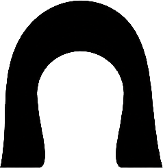
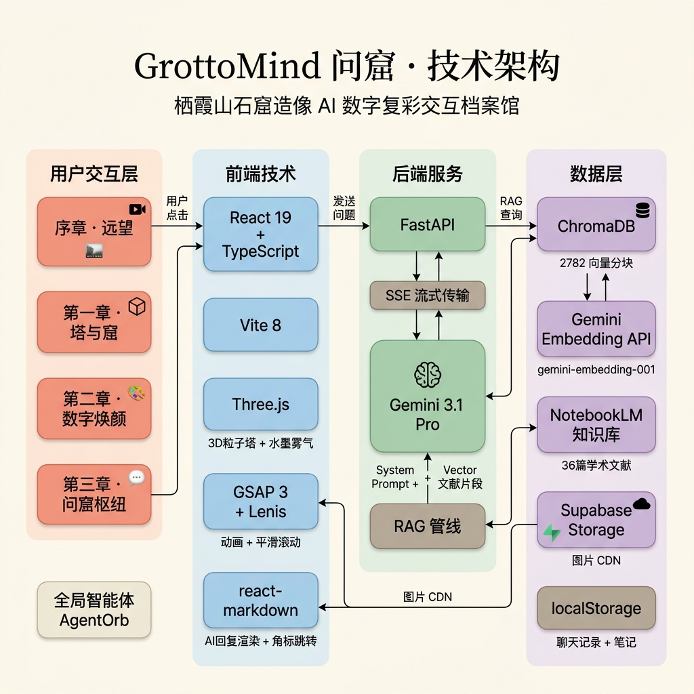

# 问窟 GrottoMind

<p align="center">
  
</p>

> 栖霞山石窟造像 AI 数字复彩交互档案馆

让沉默的石窟重新被看见、被理解、被参与。

---

## 项目简介

「问窟」是一个以栖霞山千佛岩石窟造像数字复彩为核心的交互式网站。它不是一个普通的文化介绍网站，而是一次用数字技术重新"进入"石窟的旅程。

整个网站以**单页长卷叙事**展开，用户从远望栖霞山开始，逐步走进石窟内部，了解造像的历史与风化，亲手参与数字复彩实验，与 AI 智能体对话，最终生成属于自己的"栖霞色彩记忆"。

### 核心立场

> 本项目中的"复彩"并非对历史原貌的绝对复原，而是基于文献典籍、视觉研究与 AI 技术的**数字化色彩推演**。

## 叙事结构

| 章节   | 标题     | 说明                                              | 状态      |
| ------ | -------- | ------------------------------------------------- | --------- |
| 序章   | 远望     | 滚动驱动视频 + 水墨雾气 + 叙事文案                | ✅ 已完成 |
| 第一章 | 塔与窟   | 3D 粒子塔导航 + 8 节点深度阅读 + 学术文献引注体系 | ✅ 已完成 |
| 第二章 | 数字焕颜 | 风化叙事 + 颜料考古 + 粒子流体推演实验              | ✅ 已完成 |
| 第三章 | 问窟枢纽 | 智能体"问窟者"对话 + 文献库 + 笔记系统            | ✅ 已完成 |
| 第四章 | 共创一龛 | 用户生成栖霞色彩记忆卡                            | 🔲 待开发 |
| 尾声   | 作品说明 | 设计理念与技术流程                                | 🔲 待开发 |

## 第一章 · 塔与窟

第一章以南唐栖霞山舍利塔为核心，构建了一座**博物馆级数字长卷展厅**。

### 交互架构

- **3D 粒子舍利塔**：基于 Three.js 构建的点云塔体，用户通过鼠标滚轮在 8 个标注节点间切换视角
- **GSAP 状态机**：所有镜头切换由 GSAP 时间线驱动，支持缓动锁定与过渡动画
- **深度阅读画廊**：点击节点的"深度阅读"按钮后，进入全屏横向滑动画廊

### 深度阅读节点（8 个）

| 节点   | 主题               | 核心学术内容                                 |
| ------ | ------------------ | -------------------------------------------- |
| 综述   | 南唐遗梦           | 南唐历史背景、敷金涂彩皇家工艺               |
| 塔刹   | 宇宙之轴           | 窣堵波源流、1930 年修葺悬疑                  |
| 密檐   | 无斗拱的智慧       | 梁思成实地考证、以石仿木力学原理             |
| 佛龛   | 秀骨清像与盛唐遗风 | 褒衣博带与晚唐面相的跨时代美学融合           |
| 天王   | 四大天王           | 四王独立展示、法器与色彩复原推断             |
| 菩萨   | 六牙白象与佚失大智 | 普贤幸存 / 文殊金兵毁佛 / 新样文殊图像考     |
| 须弥座 | 断代悬案           | 六朝别字误导、高越与林仁肇履历交叉推断       |
| 八相图 | 华严宗大乘孤例     | 连环画式叙事、《华严经》八相结构唯一建筑实例 |

### 学术数据来源

所有文案经由 **NotebookLM** 知识库（`流失的文物色彩：南京栖霞山石窟造像数字复彩交互设计`）查询验证，文献引注直接嵌入 UI。

### 色彩指纹系统

每张文物图片左下角附着微型**矿物颜料色卡**（Color Fingerprint），标注了基于敷金涂彩工艺推断的颜料名称与占比（如泥金 25%、朱砂 15%、石青 30%）。

## 第二章 · 数字焕颜

第二章深入栖霞山石窟内部，重点展示由于千年风化导致造像颜料剥落的现状，并通过前沿技术进行数字化复原。

### 核心功能与交互

- **颜料考古**：展示多组"显影前"与"显影后"的光谱扫描对比图，用户可通过交互滑块（InkReveal）查看石窟壁画被时光抹去的色彩空间。
- **粒子画廊系统**：采用博物馆级陈列设计的数字档案系统，展示了造像多通道光谱数据映射与三维点云推演的成果。
- **流体推演实验室**：图文结合的科研排版系统，通过嵌入优化后的 TouchDesigner 粒子流体力场视频，呈现出跨越千年的数字焕颜过程。

### 设计亮点

- 深度定制的"赛博考古"UI风格，包括卡纸级阴影装裱、等宽字体数据面板与十字瞄准星等界面微动效。
- **滚动间谍系统（Scroll Spy）**：智能跟随用户阅读进度的顶部导航系统，确保在长卷叙事下不迷失方向。

## 第三章 · 问窟枢纽

第三章是整个项目的**智能交互核心**，构建了一个完整的 AI 研究助手系统。

### 问窟 AI 对话

- **"问窟者"智能体**：基于 Gemini 3.1 Pro 构建的领域专家角色，专注于栖霞山石窟造像数字复彩研究
- **SSE 流式对话**：实时逐字输出 AI 回复，附带思考动画与矿物色卡（ColorCard）可视化
- **RAG 引用角标**：AI 回复中自动插入文献引用角标 `[1][2]`，支持悬浮显示来源文献标题，点击后跳转至文献库对应段落

### 文献档案库

- **36 篇学术文献**：覆盖石窟考古、颜料分析、色彩复原、AI 修复等领域
- **AI 智能导读**：每篇文献配有 Gemini 生成的摘要和关键词标签
- **段落精准定位**：从 AI 回复的引用角标点击后，可直接跳转到文献原文的对应段落（基于多 fragment 关键词重合度评分算法）
- **内部文献隐藏**：通过 `metadata.json` 的 `hidden` 字段控制，不对外公开展示但保留 RAG 索引

### 笔记系统

- **保存到笔记**：AI 回复下方的操作栏支持一键保存到本地笔记
- **笔记面板**：右上角入口，展示已保存的笔记卡片（含原始提问 + AI 回复），支持单条删除和清空
- **数据持久化**：基于 `localStorage`，每位访客独立存储，刷新不丢失

### 全局智能体（AgentOrb）

- **悬浮光球**：全站可见的 AI 入口，支持语音面板交互
- **上下文感知**：根据用户所在章节自动切换对话语境
- **章节间导航**：支持从任意章节直接跳转至问窟枢纽

## 技术栈

<p align="center">
  
</p>

| 类别           | 技术                                                |
| -------------- | --------------------------------------------------- |
| 前端框架       | React 19 + TypeScript                               |
| 构建工具       | Vite 8                                              |
| 动画           | GSAP 3 + ScrollTrigger                              |
| 平滑滚动       | Lenis                                               |
| 3D / 着色器    | Three.js（开场水墨雾气 + 粒子塔）                   |
| Markdown 渲染  | react-markdown                                      |
| 后端           | FastAPI (Python) + Google Gemini 3.1 Pro             |
| 向量检索       | ChromaDB + Gemini Embedding API（gemini-embedding-001）|
| 文献知识库     | NotebookLM 导出 + 本地 RAG 管线                     |
| 图片 CDN       | Supabase Storage                                    |
| 图片导出       | html-to-image                                       |

## RAG 架构

```
用户提问
  │
  ▼
Gemini Embedding API (RETRIEVAL_QUERY)
  │
  ▼
ChromaDB 向量检索 (cosine, top_k=5)
  │
  ▼
相关文献片段注入 System Prompt
  │
  ▼
Gemini 3.1 Pro 生成带引用的回复
  │
  ▼
前端渲染 Markdown + 角标跳转
```

- **文本切分**：RecursiveCharacterTextSplitter（chunk_size=500, overlap=50）
- **索引规模**：36 篇文献 → 2782 个向量分块
- **模型版本管理**：自动检测 Embedding 模型变更，必要时清除旧索引并重建

## 本地运行

本项目本地开发采用两层隔离：

- 前端依赖安装在项目内 `node_modules/`，Node 版本由 `.nvmrc` 指定为 22。
- Python 后端依赖安装在项目内 `.venv/`，不会污染系统 Python，也不会提交到 Git。

```bash
# 1. 使用项目指定的 Node 版本（如果你使用 nvm）
nvm use

# 2. 安装前端依赖
npm install

# 3. 创建 Python 虚拟环境并安装后端依赖
npm run setup:python

# 4. 配置环境变量
cp .env.example .env
# 编辑 .env，填入 GEMINI_API_KEY

# 5. 构建向量索引（首次运行）
npm run rag:build

# 6. 启动本地开发环境（前端 + Express API + FastAPI）
npm run dev:local
```

如果 `npm run setup:python` 因网络代理无法下载依赖，先确认终端可以访问 Python 包源，然后重新运行同一条命令。

- 前端：`http://localhost:5180`
- Express API：`http://localhost:8787`
- Python FastAPI：`http://localhost:8788`

## 项目结构

```
├── src/
│   ├── App.tsx                          # 应用入口与章节路由
│   ├── App.css                          # 全局样式系统
│   ├── components/
│   │   ├── IntroAnimation.tsx           # 序章 · 滚动视频叙事
│   │   ├── TimelineHall.tsx             # 第一章 · 3D粒子塔导航与节点系统
│   │   ├── DeepReadArticle.tsx          # 第一章 · 深度阅读横向画廊
│   │   ├── ParticleStupa.tsx            # 3D 粒子舍利塔渲染
│   │   ├── FadingHall.tsx               # 第二章 · 颜料考古与数字焕颜
│   │   ├── InkReveal.tsx                # 第二章 · 显影前后对比滑块
│   │   ├── GrottoHub.tsx                # 第三章 · 问窟枢纽主界面
│   │   ├── GrottoHub.css                # 第三章 · 问窟枢纽样式
│   │   ├── LiteratureLibrary.tsx        # 第三章 · 文献档案库
│   │   ├── LiteratureLibrary.css        # 第三章 · 文献库样式
│   │   ├── ColorCard.tsx                # 矿物色卡可视化组件
│   │   ├── agent/                       # 全局智能体系统
│   │   │   ├── AgentContext.tsx          #   上下文管理（章节感知）
│   │   │   ├── AgentOrb.tsx             #   悬浮光球 UI
│   │   │   ├── AgentTriggerButton.tsx   #   触发按钮
│   │   │   ├── GlobalAgent.tsx          #   全局对话面板
│   │   │   └── GlobalAgent.css          #   全局面板样式
│   │   ├── GrottoModelScene.tsx         # 石窟 3D 场景
│   │   ├── AtmosphereShader.tsx         # 水墨雾气着色器
│   │   ├── AtmosphereEffects.tsx        # 浮尘粒子系统
│   │   ├── GlobalControls.tsx           # 全局控制栏
│   │   ├── GlowText.tsx                 # 标题发光特效
│   │   ├── CustomCursor.tsx             # 自定义光标
│   │   ├── FullscreenButton.tsx         # 全屏切换
│   │   └── Exhibition.tsx               # 展览入口
│   └── main.tsx                         # 入口文件
├── server/
│   ├── main.py                          # FastAPI 应用入口（SSE 对话 + 文献 API）
│   ├── rag.py                           # RAG 模块（Gemini Embedding + ChromaDB）
│   ├── batch_summarize.py               # 批量生成文献 AI 摘要
│   ├── build_knowledge.py               # 知识库构建脚本
│   ├── notebooklm_sync.py               # NotebookLM 自动抓取
│   ├── upload_to_supabase.py            # 静态资源上传 CDN
│   ├── knowledge/                       # 文献数据 + 摘要缓存
│   │   ├── metadata.json                #   文献元数据（含 hidden 标记）
│   │   ├── *.txt                        #   文献全文（清洗后）
│   │   └── *_summary.json               #   AI 摘要缓存
│   ├── chroma_db/                       # ChromaDB 向量索引（运行时生成）
│   └── requirements.txt                 # Python 依赖清单
├── public/
│   ├── assets/                          # 静态素材（视频、字体、Logo）
│   ├── 章节1图片素材/                   # 舍利塔各部位高清图片（WebP）
│   └── 章节2素材/                       # 第二章图片与背景素材
├── Dockerfile                           # 后端容器化部署
├── index.html
└── package.json
```

## 常用命令

```bash
# 前端
npm run dev:client              # 启动前端开发环境
npm run dev:api                 # 启动 Express / Vercel Serverless API
npm run build                   # 生产构建
npm run lint                    # 代码检查

# 后端
npm run setup:python            # 创建 .venv 并安装 Python 依赖
npm run dev:python              # 使用 .venv 启动 FastAPI 后端
npm run rag:build               # 使用 .venv 重建向量索引
npm run dev:local               # 同时启动前端、Express API、FastAPI
```

## 设计原则

- **博物馆级叙事感**：每一屏都像一个展厅，不是网页
- **呼吸感节奏**：大量留白、缓慢动效、沉静文案
- **AI 实验室美学**：深色底 + 中性白灰 + 极简无衬线排版
- **轻量化实现**：优先使用预渲染视频 + CSS/GSAP 动画，避免重度 WebGL
- **文化严谨性**：区分历史依据、视觉推演与 AI 想象
- **学术引注体系**：所有文案经 NotebookLM 知识库验证，AI 回复内嵌文献角标

## 与 TouchDesigner 的关系

| TouchDesigner 作品   | GrottoMind 网站    |
| -------------------- | ------------------ |
| 沉浸式视觉输出       | 文化背景解释       |
| 动态复彩效果         | 复彩逻辑说明       |
| 光影、粒子、色彩扩散 | AI 智能导览        |
| 现场交互体验         | 用户在线交互与共创 |

> TouchDesigner 作品是"看见色彩重生"的沉浸式现场，网站是"理解色彩重生"的智能交互档案。两者共同构成完整的数字复彩设计系统。

## License

本项目为毕业设计作品，仅用于学术研究与展示。
